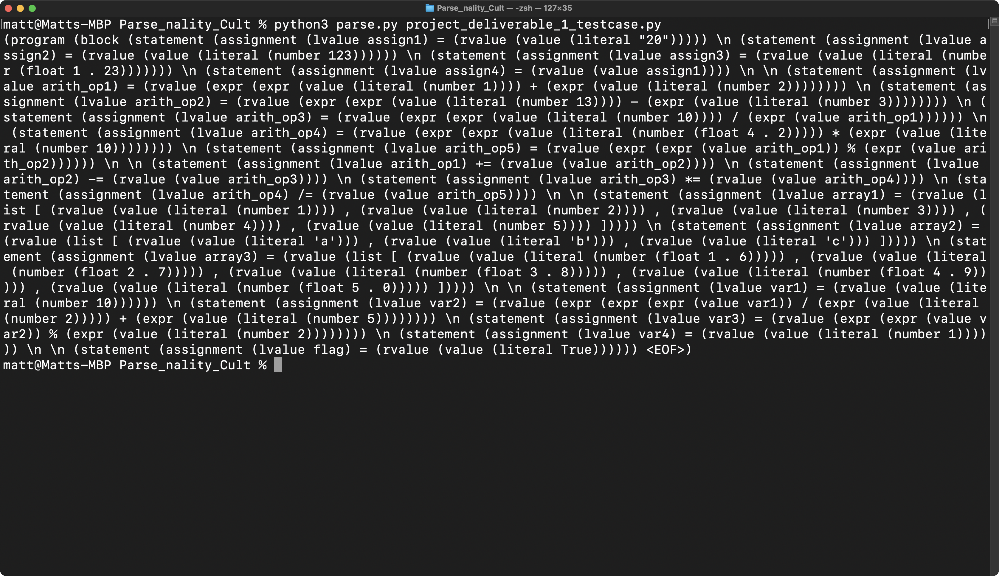

# Parse_nality_Cult

A grammar and parser for a stripped-down version of Python, as per the course requirements.

Files:
* Grammar files:
	* `PyParser.g4`
	* `PyLexer.g4`
* Parser: `parse.py`

## Team

* Dillon Jackson
* Matthew Kunze

## Usage

These instructions assume you're in a Unix environment (macOS/Linux), but it shouldn't be too different on Windows.

### Install requirements
```
pip install -r requirements.txt
```

### Build the grammar
```
./build.sh
```

### Run the parser
```
python3 parse.py input.py
```

The output is a Lisp-style representation of the parse tree:


